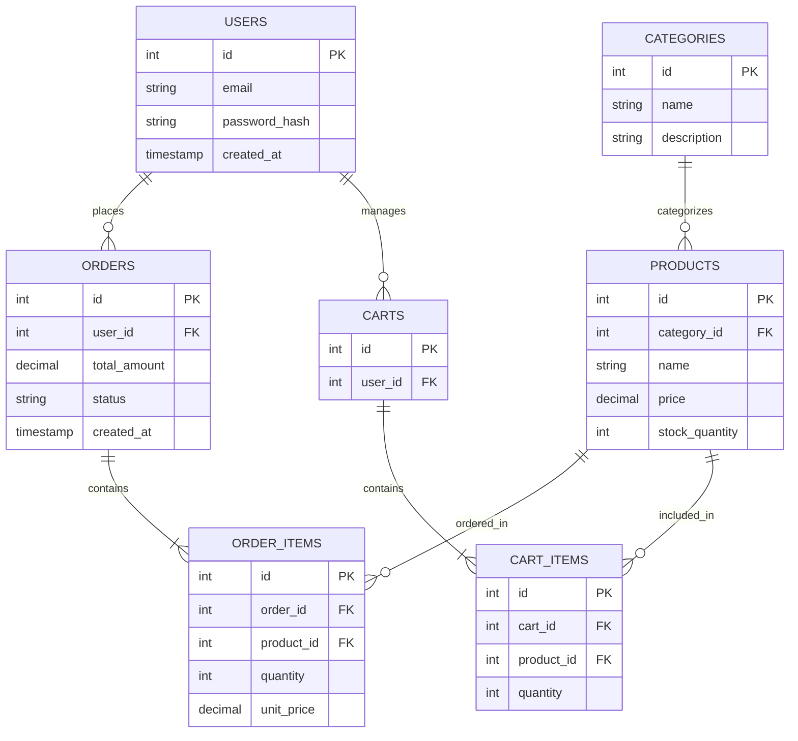

# Sprint 1: System Architecture & Scope Definition

## Section 1: Target Audience & Market Focus
* **Primary Persona:** Retail consumers and online shoppers seeking a streamlined, responsive e-commerce experience for apparel and lifestyle products.
* **Core Pain Point:** Fragmented online shopping interfaces, slow-loading category filters, and unreliable state management during cart modifications and checkout.
* **Domain Scope:** Retail Apparel & Consumer Goods.

## Section 2: Minimum Viable Product (MVP) Feature Scope Matrix

| Category | Feature Name | Description | Priority |
| :--- | :--- | :--- | :--- |
| **Authentication** | User Registration & Authentication | Password hashing and JWT-based authentication mechanism. | High (MVP) |
| **Catalog** | Product List & Search | Product browsing interface with taxonomy-based filtering. | High (MVP) |
| **Cart** | Cart Management | State persistent cart management (item addition, modification, and deletion). | High (MVP) |
| **Checkout** | Order Processing | Mock or Stripe payment gateway integration and order object instantiation. | High (MVP) |
| **Admin** | Inventory Control | Administrative CRUD operations for product inventory. | Medium |

## Section 3: Tech Stack Selection & Justification
* **Frontend Framework:** React 18 / Vite with Tailwind CSS.
  * *Justification:* Component-driven architecture allows rapid UI iteration and seamless state re-rendering. Vite provides exceptionally fast build times, while Tailwind CSS accelerates responsive design implementation through utility classes.
* **Backend Infrastructure:** Node.js / Express.
  * *Justification:* JavaScript parity across the full stack streamlines API integration and data model mapping. The Express ecosystem offers lightweight, flexible middleware routing suitable for rapid MVP deployment.
* **Database Management System:** PostgreSQL.
  * *Justification:* Relational database structure ensures strict data integrity for transactional entities like orders, inventory tracking, and user accounts, outperforming non-relational options for structured e-commerce schemas.
* **Caching & Asynchronous Processing:** Redis.
  * *Justification:* In-memory data store ideal for high-speed session management and temporary cart persistence prior to database synchronization.

## Section 4: Entity-Relationship Diagram (ERD)

